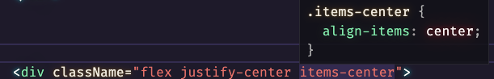

# 项目涉及知识点

`tailwindcss`、`react-hooks`、`react-router-dom`、`antd`

# 数据来源

[pokemonAPI](https://pokeapi.co/)
接口有时候很慢,有些详情页接口会404,但是大多数没问题,详情页是根据id判断的,我传的id是没问题

# 项目描述

首页提供宝可梦的搜索,

# 文档

[](https://www.tailwindcss.cn/)


[](https://ant.design/index-cn)


[react-router](https://reactrouter.com/web/guides/quick-start)

[hooks](https://zh-hans.reactjs.org/docs/hooks-intro.html)

# 创建项目

使用`npx`命令创建项目,这里`--use-yarn`表示使用`yarn`安装,你也可以使用`npm`

```bash
npx create-react-app pokemon-tailwindcss --use-yarn
```

项目使用的ts和react,使用下面命令安装

```bash
npx create react-app my-app --template typescript
```

# 引入插件

### 我们需要引入`tailwindCSS`

```bash
npm install tailwindcss@npm:@tailwindcss/postcss7-compat @tailwindcss/postcss7-compat postcss@^7 autoprefixer@^9
```

### 安装和配置CRACO

由于 Create React App 不能让您覆盖原生的 PostCSS 配置，所以我们还需要安装[ CRACO ](https://github.com/gsoft-inc/craco)才能配置 Tailwind。

```bash
npm install @craco/craco
```

安装完毕后，更新 `package.json` 文件中的 `scripts`，将 `eject` 以外的所有脚本都用 `craco` 代替 `react-scripts`。

```diff-json
  {
    // ...
    "scripts": {
-     "start": "react-scripts start",
-     "build": "react-scripts build",
-     "test": "react-scripts test",
+     "start": "craco start",
+     "build": "craco build",
+     "test": "craco test",
      "eject": "react-scripts eject"
    },
  }
```

接下来，在项目根部创建一个 `craco.config.js`，并添加 `tailwindcss` 和 `autoprefixer `作为 PostCSS 插件。

```js
// craco.config.js
module.exports = {
  style: {
    postcss: {
      plugins: [
        require('tailwindcss'),
        require('autoprefixer'),
      ],
    },
  },
}
```

如果您计划使用任何其他 PostCSS 插件，您应该阅读我们的文档[使用 PostCSS 作为您的预处理器](https://www.tailwindcss.cn/docs/using-with-preprocessors)，以获得更多关于集成它们和 Tailwind 的最佳方式的细节。

### 创建配置文件

接下来，生成您的 `tailwind.config.js` 文件：

```shell
npx tailwindcss init
```

这将会在您的项目根目录创建一个最小化的 `tailwind.config.js` 文件：

```js
// tailwind.config.js
module.exports = {
  purge: [],
  darkMode: false, // or 'media' or 'class'
  theme: {
    extend: {},
  },
  variants: {
    extend: {},
  },
  plugins: [],
}
```

阅读[配置文档](https://www.tailwindcss.cn/docs/configuration)了解更多。

###  配置 Tailwind 来移除生产环境下没有使用到的样式声明

在您的 `tailwind.config.js` 文件中，配置 `purge` 选项指定所有的 components 文件，使得 Tailwind 可以在生产构建中对未使用的样式进行`tree shaking`优化。

```diff-js
-   purge: [],
+   purge: ['./src/**/*.{js,jsx,ts,tsx}', './public/index.html'],
```

### 在CSS中引入tailwind

Tailwind 会在构建时将这些指令转换成所有基于您配置的设计系统生成的样式文件。

在`index.jsx`或者`index.tsx`中引入`index.css`

### 引入React router dom

```bash
npm i react-router-dom
```

如果你是ts,别忘了安装其声明文件

```bash
npm i --save-dev @types/react-router-dom
```

### 引入antd

```bash
npm i -D antd
```

### 下载tailwindcss插件

在开始之前，在`vscode`中下载`Tailwind CSS IntelliSense`,以确保在编写`tailwindcss`时获取相应的提示,就像👇一样



# 结尾
因为api没有提供查询接口,而功能上是要有查询功能的,所以会在页面加载时请求所有的数据,会写入localstorage中,这个数据只会在做查询时用到,加载按钮还是一次请求100条数据,加载的是新请求的数据,两个数据是独立的状态,不知道你懂没有...
# 思考
Home里面的状态有没有多余的？
项目有性能问题吗?


